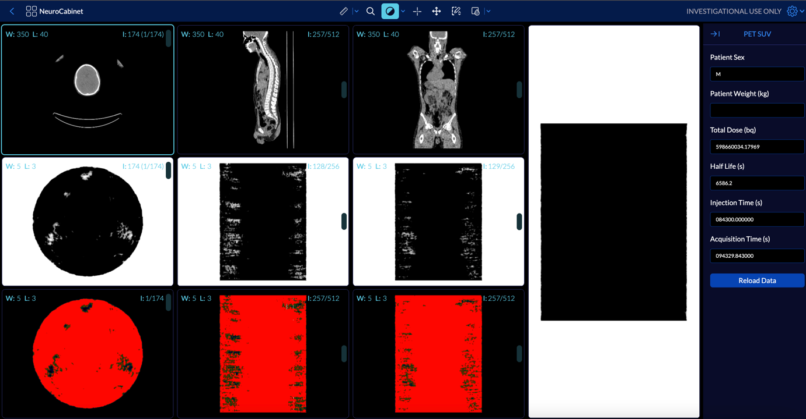

##Расположение

Разработанный макет для видовых экранов соответствует предопределенному протоколу подвешивания, который разместит 10 видовых экранов, содержащих сцены CT, PT, Fusion и проекции максимальной интенсивности (MIP) PT.

Протокол подвешивания будет соответствовать наборам дисплеев CT и PT на основе описания серии. Что касается наборов дисплеев PT, протокол зависания будет соответствовать набору дисплеев PT, который содержит ослабленные скорректированные данные изображения ПЭТ.

Как видно на изображении ниже, первый ряд содержит объем компьютерной томографии в 3 различных ракурсах: аксиальном, сагиттальном и коронарном. Вторая строка содержит объем PT в тех же видах, что и первая строка. Последняя строка содержит объем слияния, а окно просмотра справа представляет собой MIP объема PT в сагиттальном представлении.

##MIP

Инструменты, которые активируются на каждом видовом экране, уникальны для его данных. Например, инструмент прокрутки мыши для видовых экранов PT, CT и Fusion прокручивает данные изображения (в разных направлениях); однако инструмент прокрутки мыши для видового экрана MIP будет поворачивать камеру в соответствии с условиями использования для MIP.

##Panels
В режиме рабочего процесса TMTV доступны две панели, и мы подробно обсудим их ниже.

##SUV Panel
На этой панели отображаются метаданные PT, полученные из соответствующего набора отображения PT. Пользователь может редактировать/изменять метаданные, если это необходимо, и при перезагрузке данных новые метаданные будут применены к тому PT.

##ROI Threshold Panel
Панель порога рентабельности инвестиций - это панель, которая позволяет пользователю использовать инструмент RectangleROIStartEnd из Cornerstone для определения и редактирования интересующей области. Затем пользователь может применить пороговое значение к пикселям в ROI и сохранить результат в виде объема 

##Отчет об экспорте
Наконец, результаты могут быть сохранены в формате CSV. Аннотации Rectangle ROI также могут быть извлечены в виде набора структур dicom RT и сохранены в виде файла DICOM.

##Видеоурок
Ниже вы можете увидеть видеоурок о том, как использовать режим рабочего процесса TMTV.

https://user-images.githubusercontent.com/7490180/171065443-35369fba-e955-48ac-94da-d262e0fccb6b.mp4
